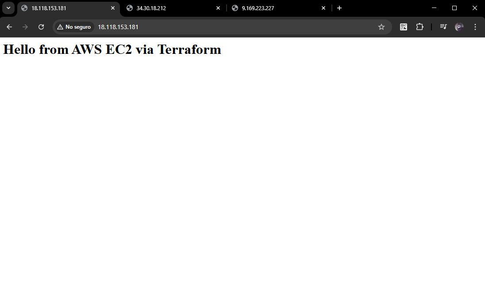
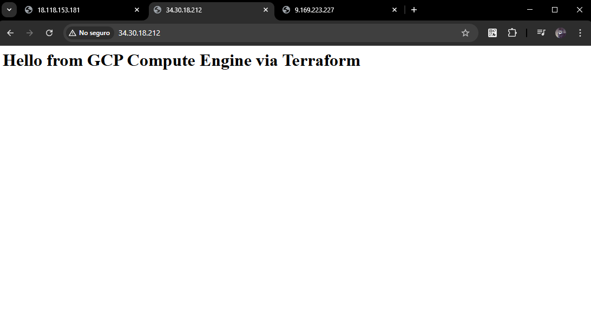

# multi-cloud-vm-server-deployer

# 1. Overview

This simple project deploys a virtual machine on AWS, Azure, and GCP, each running a simple web server (Apache or Nginx), exposing HTTP on port 80, and accessible via a browser.

The deployment is fully automated using Terraform, with one VM per cloud provider.

# 2. Project Structure (Temporary)

```
multi-cloud-vm-server-deployer/
│── aws-ec2.tf/
│── azure-vm.tf/
│── gcp-compute.tf/
│── screenshots-examples/
│── README.md

```
# 3. Deployment with Terraform Global commands:
```
terraform init
terraform plan
terraform apply

```


# AWS Deployment (CLI Example)
```
aws ec2 create-security-group \
    --group-name web-sg \
    --description "Security group for web server"

aws ec2 authorize-security-group-ingress \
    --group-name web-sg \
    --protocol tcp --port 80 --cidr 0.0.0.0/0

aws ec2 authorize-security-group-ingress \
    --group-name web-sg \
    --protocol tcp --port 22 --cidr $(curl -s ifconfig.me)/32

aws ec2 create-key-pair \
  --key-name my-key \
  --query 'KeyMaterial' --output text > my-key.pem
chmod 400 my-key.pem

aws ec2 run-instances \
    --image-id ami-0c1c30571d2dae5c9 \
    --instance-type t2.micro \
    --key-name my-key \
    --security-groups web-sg \
    --user-data '#!/bin/bash
yum update -y
yum install -y httpd
systemctl start httpd
systemctl enable httpd
echo "<h1>Hello from AWS EC2</h1>" > /var/www/html/index.html'

aws ec2 describe-instances \
    --filters "Name=instance-state-name,Values=running" \
    --query 'Reservations[*].Instances[*].PublicIpAddress' \
    --output table

    
```

### Web Server Example (Apache on AWS) 



# Azure Deployment (CLI Example)
```
az group create --name rg-web-server --location westeurope

az vm create \
    --resource-group rg-web-server \
    --name web-server-azure \
    --image Ubuntu2204 \
    --size Standard_B1s \
    --admin-username azureuser \
    --generate-ssh-keys \
    --custom-data cloud-init.txt

az vm open-port \
    --resource-group rg-web-server \
    --name web-server-azure \
    --port 80 \
    --priority 1001

az vm show \
    --resource-group rg-web-server \
    --name web-server-azure \
    --show-details --query publicIps --output tsv


```
### Custom data file `cloud-init.txt`

```
#cloud-config
package_update: true
packages:
  - nginx
runcmd:
  - systemctl start nginx
  - systemctl enable nginx
  - echo "<h1>Hello from Azure VM</h1>" > /var/www/html/index.html
```

### Nginx Server (Azure)


# GCP Deployment (CLI Example)


```
gcloud compute firewall-rules create allow-http \
    --allow tcp:80 \
    --target-tags http-server \
    --description="Allow HTTP traffic"

gcloud compute instances create web-server-gcp \
    --zone=europe-west1-b \
    --machine-type=e2-micro \
    --image-family=ubuntu-2204-lts \
    --image-project=ubuntu-os-cloud \
    --tags=http-server \
    --metadata=startup-script='#!/bin/bash
apt-get update
apt-get install -y apache2
systemctl start apache2
systemctl enable apache2
echo "<h1>Hello from GCP Compute Engine</h1>" > /var/www/html/index.html'

gcloud compute instances describe web-server-gcp \
    --zone=europe-west1-b \
    --format='get(networkInterfaces[0].accessConfigs[0].natIP)'

```


###  Apache Server (GCP)

